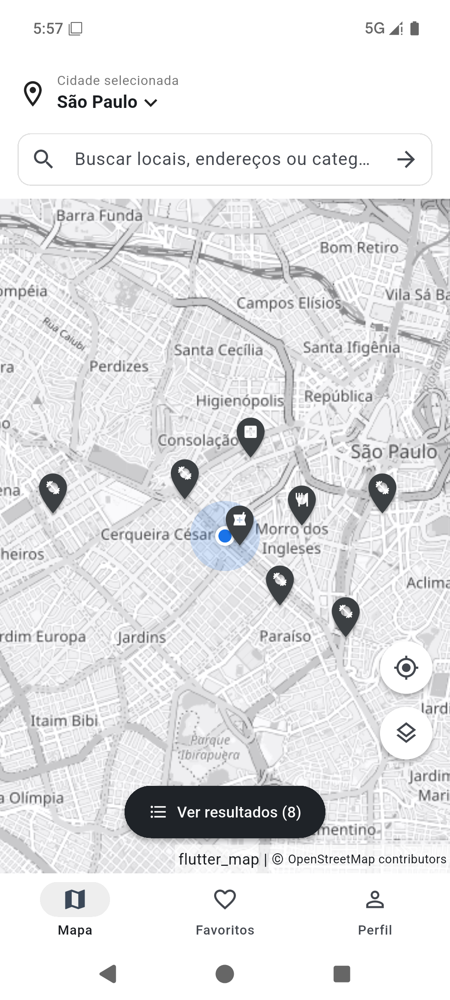
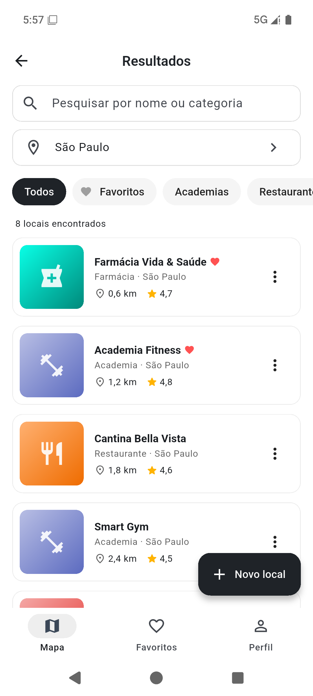
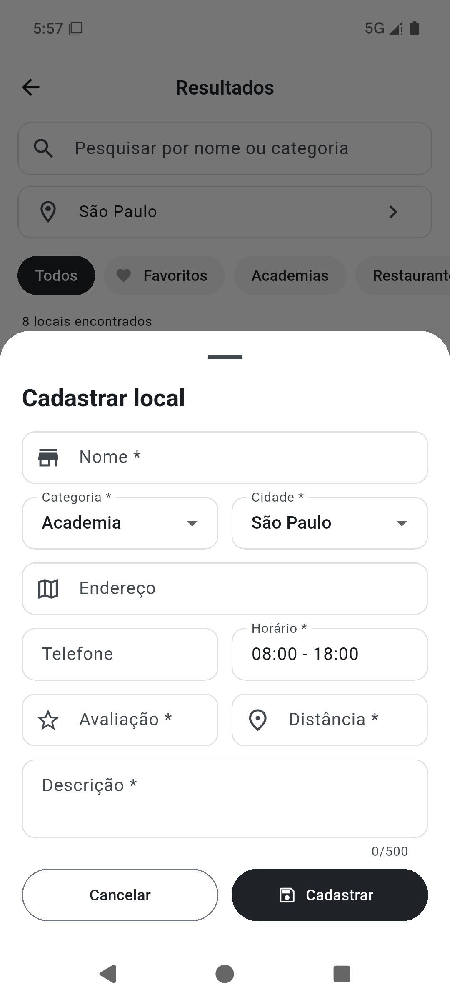
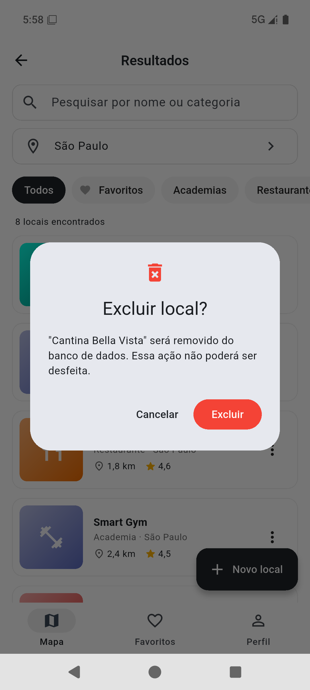

# Mapa de Locais — Flutter + Cloud Firestore

Aplicação mobile de localização de estabelecimentos (mapa, pesquisa, resultados e detalhes),
desenvolvida em Flutter com Firebase Cloud Firestore para a Avaliação Formativa de
Desenvolvimento de Aplicação Mobile com Flutter.

> ⚠️ **Pendente:** o app está pronto e testado com o emulador local do Firestore, mas ainda
> precisa ser ligado ao projeto Firebase real (criar projeto, `flutterfire configure`, publicar
> regras e popular o banco). Veja o passo a passo em
> **[PROXIMOS_PASSOS_FIREBASE.md](PROXIMOS_PASSOS_FIREBASE.md)**.

| Tela 1 — Mapa principal | Tela 2 — Resultados | Tela 3 — Detalhes |
|---|---|---|
|  |  |  |

---

## 1. Problemática

Uma empresa deseja disponibilizar um aplicativo que permita aos usuários localizar serviços e
estabelecimentos em diferentes cidades. O usuário precisa selecionar a cidade, pesquisar o que
procura, filtrar os resultados, abrir os detalhes de um estabelecimento e marcar locais como
favoritos. Além disso, novos locais precisam ser cadastrados e os registros existentes precisam
poder ser alterados ou excluídos — portanto os dados não podem ficar fixos no código.

## 2. Objetivo da aplicação

Oferecer um guia de estabelecimentos (academias, restaurantes, hospitais, farmácias, mercados e
cafés) de São Paulo, Campinas e Jundiaí, com mapa real, pesquisa, filtros, detalhes e favoritos,
armazenando todos os dados na coleção `locais` do Cloud Firestore com operações completas de CRUD.

## 3. Requisitos funcionais

| Código | Requisito | Como foi atendido |
|---|---|---|
| RF01 | Selecionar cidade | Seletor "Cidade selecionada" no mapa e filtro de cidade nos resultados (São Paulo, Campinas, Jundiaí e "Todas"). |
| RF02 | Pesquisar | Campo de pesquisa no mapa e nos resultados; busca por nome **ou** categoria, sem diferenciar maiúsculas e acentos. |
| RF03 | Consultar Firestore | `LocalService.listarLocais()` usa `snapshots()` da coleção `locais` (atualização em tempo real). |
| RF04 | Filtrar | Chips de categoria, filtro de cidade e filtro de favoritos na tela de resultados. |
| RF05 | Cadastrar local | Botão "Novo local" abre formulário em Bottom Sheet → `locais.add()`. |
| RF06 | Editar local | Menu ⋮ → "Editar" abre o mesmo formulário preenchido → `locais.doc(id).update()`. |
| RF07 | Excluir local | Menu ⋮ → "Excluir" pede confirmação em diálogo → `locais.doc(id).delete()`. |
| RF08 | Detalhes | Tela 3 com imagem, nome, categoria, avaliação, distância, horário (aberto/fechado), descrição, endereço e telefone. |
| RF09 | Favoritar | Coração na tela de detalhes altera o campo `favorito` do documento. |
| RF10 | Navegação | Mapa → Resultados → Detalhes, botão voltar, "Ver no mapa" e barra inferior (Mapa, Favoritos, Perfil). |

## 4. Requisitos não funcionais

- Desenvolvido em **Flutter/Dart**, executando em **Android**.
- Banco de dados **Cloud Firestore**, configurado com **FlutterFire CLI** (`lib/firebase_options.dart`).
- Código organizado em pastas (`models`, `services`, `screens`, `widgets`, `dialogs`, `utils`, `data`).
- Exclusões sempre pedem confirmação.
- Toda operação de banco mostra mensagem de **sucesso** (verde) ou **erro** (vermelha), com tradução
  dos erros mais comuns do Firestore (sem permissão, sem conexão, registro inexistente).
- Estados de carregamento, lista vazia e erro de conexão tratados na interface.
- Regras de segurança do Firestore validam os dados (ver seção 9).

## 5. Tecnologias utilizadas

| Tecnologia | Uso |
|---|---|
| Flutter 3.47 / Dart 3.13 | Interface e lógica |
| Firebase (`firebase_core`) | Backend |
| Cloud Firestore (`cloud_firestore`) | Banco de dados NoSQL |
| Firebase CLI + FlutterFire CLI | Criação e configuração do projeto Firebase |
| `flutter_map` + OpenStreetMap | Mapa real (desafio extra nível 2) |
| `url_launcher` | Ações "Ligar" e "Como chegar" |
| `fake_cloud_firestore`, `integration_test` | Testes automatizados |

## 6. Arquitetura do projeto

```
lib/
├── main.dart                 # inicializa o Firebase e abre o app
├── app.dart                  # MaterialApp, tema e injeção do serviço
├── app_scope.dart            # disponibiliza o serviço e o "foco" do mapa às telas
├── firebase_options.dart     # gerado pelo FlutterFire CLI
├── models/
│   ├── local.dart            # Model Local (fromMap / toMap)
│   ├── cidade.dart           # cidades e coordenadas centrais
│   └── categoria.dart        # categorias, ícones e cores
├── services/
│   └── local_service.dart    # único ponto de acesso ao Firestore (CRUD)
├── screens/
│   ├── mapa_screen.dart      # Tela 1
│   ├── resultados_screen.dart# Tela 2
│   └── detalhes_screen.dart  # Tela 3
├── widgets/
│   ├── local_card.dart       # item da lista
│   ├── local_form.dart       # formulário de cadastro/edição (Bottom Sheet)
│   ├── mapa_locais.dart      # mapa com marcadores
│   ├── local_imagem.dart     # imagem ilustrativa por categoria
│   └── barra_navegacao.dart  # barra inferior Mapa / Favoritos / Perfil
├── dialogs/
│   ├── confirm_delete.dart   # confirmação de exclusão
│   ├── seletor_cidade.dart   # escolha de cidade
│   └── perfil_sheet.dart     # aba Perfil (resumo do banco)
├── utils/                    # filtros, formatação, coordenadas e mensagens
└── data/
    └── locais_exemplo.dart   # 20 locais para popular o banco
```

**Camadas:** as telas (`screens`) nunca acessam o Firestore diretamente — elas chamam o
`LocalService`, que converte documentos em objetos `Local` (Model) e vice-versa. Isso isola o
banco da interface e permite testar as telas com um Firestore falso.

**Navegação:** o app mantém **três telas principais**. Cadastro/edição usam Bottom Sheet,
exclusão usa AlertDialog, a aba **Favoritos** abre a tela de resultados já filtrada e a aba
**Perfil** abre um Bottom Sheet. "Ver no mapa" volta à Tela 1 centralizando o local escolhido.

## 7. Modelo da coleção `locais`

| Campo | Tipo | Obrigatório | Exemplo |
|---|---|---|---|
| nome | String | sim | "Academia Fitness" |
| categoria | String | sim | "Academia" |
| cidade | String | sim | "São Paulo" |
| avaliacao | Number (0–5) | sim | 4.8 |
| distancia | Number (km) | sim | 1.2 |
| horario | String | sim | "06:00 - 22:00" |
| descricao | String | sim | "Academia completa com musculação..." |
| favorito | Boolean | sim | false |
| endereco | String | não | "Rua Augusta, 1500 - Consolação" |
| telefone | String | não | "(11) 3000-1001" |
| latitude / longitude | Number | não | -23.5572 / -46.6620 |

O ID de cada documento é gerado automaticamente pelo Firestore (`add()`) e guardado no campo
`id` do Model para permitir edição, exclusão e favoritos. Os campos complementares
(`endereco`, `telefone`, coordenadas) alimentam a tela de detalhes e os marcadores do mapa;
no cadastro pelo app as coordenadas são geradas perto do centro da cidade escolhida.

## 8. Operações CRUD

| Operação | Firestore | Método no `LocalService` | Onde é usado |
|---|---|---|---|
| Create | `locais.add(map)` | `adicionar(local)` | "Novo local" (resultados) |
| Read | `locais.snapshots()` / `doc(id).snapshots()` | `listarLocais()` / `observarLocal(id)` | Mapa, resultados, detalhes |
| Update | `locais.doc(id).update(map)` | `atualizar(local)` | "Editar" (resultados) |
| Update parcial | `locais.doc(id).update({'favorito': ...})` | `alterarFavorito(id, valor)` | Coração (detalhes) |
| Delete | `locais.doc(id).delete()` | `excluir(id)` | "Excluir" + confirmação |

Como a leitura usa `snapshots()`, qualquer alteração (inclusive feita no Console do Firebase)
aparece na hora em todas as telas, sem recarregar. Pesquisa e filtros são aplicados em memória
(`utils/filtros.dart`), como sugerido no tutorial.

## 9. Regras de segurança

O banco **não** fica aberto. O arquivo [`firestore.rules`](firestore.rules) é publicado no
projeto com `firebase deploy --only firestore:rules`:

- tudo fora da coleção `locais` é **negado**;
- leitura de `locais` é pública (é um guia de estabelecimentos);
- cadastro e edição só são aceitos se o documento seguir o modelo: somente campos conhecidos,
  tipos corretos, nome de 1 a 80 caracteres, categoria e cidade dentro das listas permitidas,
  avaliação entre 0 e 5, distância entre 0 e 500 e limites de tamanho nos textos.

Validação feita contra o emulador do Firestore: documento válido → **200**; avaliação 9, campo
extra (`admin`), cidade fora da lista, documento sem `nome`, escrita/leitura em outra coleção →
**403 PERMISSION_DENIED**.

> Próximo passo (desafio nível 3): exigir autenticação (`request.auth`) para cadastro, edição e
> exclusão, separando usuários comuns de administradores.

## 10. Testes

### Testes obrigatórios

> Resultados obtidos no emulador Android (Pixel 8, Android 16) com o **emulador local do
> Firestore**. Após ligar o Firebase real, repetir `flutter test integration_test` para
> confirmar no banco em nuvem.

| ID | Teste | Procedimento | Resultado | Evidência automatizada |
|---|---|---|---|---|
| T01 | Conexão | Abrir o app e verificar se os dados do Firestore aparecem | **Passou** | `integration_test/app_test.dart`, `test/widget_test.dart` |
| T02 | Pesquisa | Pesquisar por "Academia" | **Passou** | integração + widget + `test/filtros_test.dart` |
| T03 | Cidade | Selecionar Campinas | **Passou** | integração + widget |
| T04 | Filtro | Selecionar uma categoria | **Passou** | integração + widget |
| T05 | Create | Cadastrar um novo local e verificar no Firestore | **Passou** | integração (consulta o documento no Firestore) |
| T06 | Read | Fechar/reabrir a tela e verificar o registro | **Passou** | integração |
| T07 | Update | Editar nome e horário e confirmar a alteração | **Passou** | integração (confere o documento) + widget |
| T08 | Delete | Excluir um local e confirmar que desapareceu | **Passou** | integração + widget (inclui "Cancelar") |
| T09 | Favorito | Marcar e desmarcar um local | **Passou** | integração (confere o campo `favorito`) + widget |
| T10 | Navegação | Abrir resultados e detalhes e retornar | **Passou** | integração + widget |
| T11 | Erro | Simular ausência de dados/erro e verificar mensagem | **Passou** | widget: banco vazio e falha de conexão |

### Como executar

```bash
flutter test                                   # 31 testes de unidade e de widget
flutter test integration_test -d emulator-5554 # roda no emulador Android, no Firestore real
# ou, contra o emulador local do Firestore:
flutter test integration_test -d emulator-5554 --dart-define=USAR_EMULADOR=true
```

- `test/local_test.dart` — conversões do Model (`fromMap`/`toMap`).
- `test/filtros_test.dart` — pesquisa, filtros, ordenação, horário de funcionamento.
- `test/local_service_test.dart` — CRUD do serviço contra um Firestore em memória.
- `test/widget_test.dart` — fluxos das telas (T01–T11) com Firestore em memória.
- `integration_test/app_test.dart` — fluxo completo no aparelho, conectado ao Firestore; cria,
  edita, favorita e exclui um local próprio, sem alterar os demais.

## 11. Capturas

| Cadastro (Bottom Sheet) | Exclusão com confirmação |
|---|---|
|  |  |

**Print do Firestore:** ⏳ pendente — salvar em `docs/prints/firestore_console.png` (Console do
Firebase → Firestore Database → coleção `locais`) depois de ligar o projeto real.

## 12. Como executar o projeto

1. Abrir o emulador: dê dois cliques em `iniciar_emulador.bat` (ele escolhe servidores DNS que
   funcionam na rede atual — sem isso, em algumas redes o emulador fica sem internet e o mapa
   não carrega).
2. Na pasta do projeto: `flutter pub get` e `flutter run`
   (antes, configure o Firebase — ver [PROXIMOS_PASSOS_FIREBASE.md](PROXIMOS_PASSOS_FIREBASE.md)).
3. Se a coleção estiver vazia, a tela de resultados oferece o botão
   **"Cadastrar locais de exemplo"** (20 locais, ao menos 5 por cidade).
4. Para desenvolver sem internet/Firebase: `firebase emulators:start --only firestore --project demo-mapa-locais`
   e `flutter run --dart-define=USAR_EMULADOR=true`.

## 13. Desafios extras

- **Nível 2 — Mapa real:** mapa do OpenStreetMap (`flutter_map`) com marcadores posicionados
  pelas coordenadas de cada local, posição do usuário, troca de estilo e "Ver no mapa".

## 14. Conclusão

O projeto foi desenvolvido por etapas: primeiro a conexão Flutter + Firebase e a leitura da
coleção, depois a tela de resultados, o CRUD e, por fim, detalhes, favoritos, filtros e o
acabamento visual próximo ao wireframe. Separar Model, serviço e telas deixou o código mais
simples de manter e permitiu testar as telas com um Firestore falso, além do teste de
integração contra o banco real. O uso de `snapshots()` tornou a interface reativa — cadastros,
edições, exclusões e favoritos aparecem imediatamente em todas as telas. Também ficou claro que
um banco em nuvem precisa de regras de segurança: mesmo sem login, as regras impedem dados
fora do modelo e o acesso a outras coleções; o próximo passo natural é adicionar autenticação
para restringir as operações administrativas.
